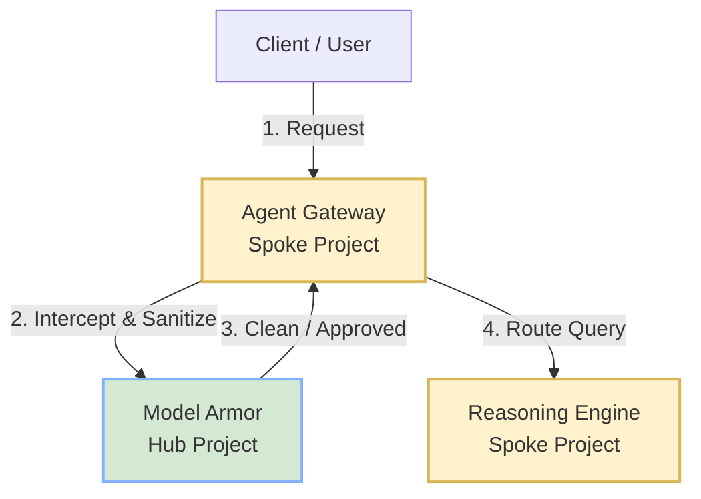

# Hub-Spoke Agent Discovery & Setup

This repository outlines the steps to deploy an agent in a spoke project and have it automatically discovered and searchable from a hub project using App Hub boundary.


## Architecture Overview

There are two verified deployment options for cross-project agent discovery:

### Option A: Folder-Level Boundary (Recommended for Automation)
- **Folder**: `Agent Registry Workshop` (`folders/187501181465`) containing both projects.
- **Management Project (Hub)**: `google-mpf-ts8stlb51ana` (automatically created by GCP to manage the folder boundary).
- **Spoke Project**: `agent-spoke` (where agents are deployed).
- **Discovery**: Automatic. Any agent deployed in any project under this folder is automatically discovered.

### Option B: Project-Level Boundary (Manual Attachment)
- **Hub Project**: `wortz-project-352116` (manually configured as App Hub Host).
- **Spoke Project**: `agent-spoke` (where agents are deployed).
- **Discovery**: Manual. The spoke project must be explicitly attached to the hub project.

## Setup Steps

### 1. Deploy Agent to Spoke Project

Deploy the agent to the `agent-spoke` project. Note that in the current early-access phase, the Agent Gateway integration might need to be bypassed if the project is not allowlisted.

**Command:**
```bash
# Set project context
gcloud config set project agent-spoke

# Deploy agent using ADK (example deployment config)
# Ensure gateway configuration is omitted if not allowlisted.
python3 src/deploy/deploy_agents.py
```

*Verified Reasoning Engine deployed in spoke:*
`projects/371207989051/locations/us-central1/reasoningEngines/4240726738134368256`

### 2. Configure App Hub Boundary

Configure the App Hub boundary using one of the following options:

#### Option A: Folder-Level Boundary (Recommended)
No command is required to attach the spoke project to the hub. When Application Management is enabled on the parent folder (`folders/187501181465`), GCP automatically provisions a dedicated system-managed project (`google-mpf-ts8stlb51ana`) that acts as the boundary host. All projects inside this folder are automatically boundary-attached.

#### Option B: Project-Level Boundary (Manual Attachment)
Manually attach the spoke project (`agent-spoke`) to your user-owned hub project (`wortz-project-352116`).

**Command (Run from Hub Project context):**
```bash
gcloud apphub service-projects add agent-spoke \
    --project=wortz-project-352116
```

---

### 3. Verify Discovery

Once the boundary is active, App Hub will automatically discover the Reasoning Engine in the spoke project. It might take a few minutes.

**Command to list discovered workloads (e.g., in `us-west1`):**
```bash
# For Option A (Folder-level):
gcloud apphub discovered-workloads list \
    --project=google-mpf-ts8stlb51ana \
    --location=us-west1 \
    --filter="workloadReference.uri:aiplatform.googleapis.com"

# For Option B (Project-level):
gcloud apphub discovered-workloads list \
    --project=wortz-project-352116 \
    --location=us-west1 \
    --filter="workloadReference.uri:aiplatform.googleapis.com"
```

*Note: The location must match the region where the agent was deployed (e.g., `us-west1`).*

---

### 4. Search Agent Registry

Verify that the discovered agent is visible and searchable in the Agent Registry.

**Command:**
```bash
# For Option A (Folder-level):
gcloud alpha agent-registry agents search \
    --project=google-mpf-ts8stlb51ana \
    --location=us-west1

# For Option B (Project-level):
gcloud alpha agent-registry agents search \
    --project=wortz-project-352116 \
    --location=us-west1
```

> [!IMPORTANT]
> *   **Location Specific**: You must query the specific location where the agent is deployed. Multi-region search or location wildcards (like `--location=-`) are not supported.
> *   **Search vs List**: The `list` command only returns local project resources. You must use `search` to query across the project boundary.
> *   **Not a Configuration Step**: The `search` command is a query, not a configuration. Discovery is automated once the App Hub boundary is set up.

For a full list of deployed agents and their locations, see [agents.md](file:///usr/local/google/home/jwortz/hub-spoke-agents-gcp-26/agents.md).

---

## Complete Bootstrap & Configuration Reference

This section provides the end-to-end `gcloud` commands required to enable services, attach projects, and configure applications like `payroll-app`.

### 1. Enable Required Services
Run this in **both** the Hub (`wortz-project-352116`) and Spoke (`agent-spoke`) projects:

```bash
gcloud services enable \
    agentregistry.googleapis.com \
    apphub.googleapis.com \
    aiplatform.googleapis.com
```

### 2. Configure App Hub Boundary (Attach Spoke to Hub)
Run this from the context of the **Hub Project** to attach the Spoke project:

```bash
gcloud apphub service-projects add agent-spoke \
    --project=wortz-project-352116
```

### 3. Create the App Hub Application (e.g., `payroll-app`)
Run this in the **Hub Project** to create the logical application group:

```bash
gcloud apphub applications create payroll-app \
    --location=us-central1 \
    --scope-type=REGIONAL \
    --project=wortz-project-352116
```

### 4. Register Discovered Workload to the Application
After the agent is deployed in the Spoke and discovered by the Hub's App Hub, you can register its workload reference to the application.

First, find the discovered workload ID (e.g. in `us-central1` or `us-west1` depending on where the agent is deployed):
```bash
gcloud apphub discovered-workloads list \
    --project=wortz-project-352116 \
    --location=us-central1 \
    --filter="workloadReference.uri:aiplatform.googleapis.com"
```

Then, register it to `payroll-app` (replace `DISCOVERED_WORKLOAD_ID` with the ID from the previous command):
```bash
gcloud apphub applications workloads create coordinator-workload \
    --application=payroll-app \
    --location=us-central1 \
    --discovered-workload=DISCOVERED_WORKLOAD_ID \
    --project=wortz-project-352116
```

---

## Investigation on Custom Attributes

The request to set custom attributes (`agent=payroll`, `org=hr`) was investigated, but it was determined that **custom attributes are currently not supported** for implicitly registered agents in this environment.

### Findings:
1. **CLI Limitation**: The `gcloud alpha agent-registry agents` CLI does not have a `settings` group (e.g., `gcloud ... agents settings update` returns "Invalid choice").
2. **API Endpoint (404)**: Direct REST API calls to the settings resource (e.g., `PATCH /v1/projects/.../agents/.../settings`) return `404 Not Found`, indicating the route is not deployed in production.
3. **Translation Code**: Analysis of the backend translation code (`agent_converter.cc` and `agent_registry_converters.cc` in App Hub directory service) confirmed that only system attributes (`Framework`, `RuntimeIdentity`, `RuntimeReference`) are populated during ingestion. Custom labels from Vertex AI Reasoning Engines are not read or mapped.
4. **App Hub Workload Labels**: App Hub Workloads do not expose a way to set custom labels/attributes via `gcloud` (no `--labels` flag), and the internal schema for `AgentProperties` does not define a field for custom attributes.

---

## Centralized Governance Capabilities

Once agents are discovered in the Hub project, you can govern them using several built-in mechanisms:

### 1. Identity & Access Management (IAM) & Groups
*   **Runtime Principal**: The registry exposes the agent's runtime identity (verifiable service account or workload identity). You can manage what resources (databases, APIs, GCP services) this identity is allowed to access.
*   **Invocation Control**: You can control which users or services have permission to invoke the agent's endpoint.
*   **IdP Groups**: Access to agents or auth providers can be governed using standard Cloud Identity Groups (managed via `gcloud identity groups`), which can be synchronized with your enterprise Identity Provider (IdP) like Okta or Microsoft Entra ID.

### 2. Connection Control (Bindings & Endpoints)
You can define explicit **Bindings** in the Hub registry to authorize connections between a source agent and a target (another agent, MCP server, or API endpoint). This allows you to restrict:
*   Which tools/MCP servers an agent is allowed to use.
*   Which other agents an agent is allowed to communicate with.
*   **Endpoints**: Target API endpoints (typically REST APIs) are represented as `Endpoint` resources in the registry. They are discovered automatically from App Hub Services. You can query them using:
    ```bash
    gcloud alpha agent-registry endpoints list --location=us-west1
    ```

Command to create a binding:
```bash
gcloud alpha agent-registry bindings create my-binding \
    --location=us-west1 \
    --source-identifier=urn:agent:projects-371207989051:projects:371207989051:locations:us-west1:aiplatform:reasoningEngines:8828119596901859328 \
    --target-identifier=urn:mcp:projects-371207989051:projects:371207989051:locations:us-west1:mcpServers:my-mcp-server \
    --project=wortz-project-352116
```

### 3. Centralized Credential Management (Auth Providers)
You can bind agents to **Auth Providers** configured in the Hub to securely manage and delegate credentials (like OAuth scopes or API keys) for external tool access, preventing secrets from being exposed in Spoke projects.
*   **Management**: Auth Providers are managed via the Agent Identity API:
    ```bash
    gcloud alpha agent-identity auth-providers list --location=us-west1
    ```

---

## Observability (Monitoring & Alerting)

To monitor the agent's performance (latency, errors, token usage) from the Hub project:

### Recommended: Cross-Project Metrics Scoping
Add the Spoke project to the Hub project's Metrics Scope. This allows the Hub project's Cloud Monitoring to query and alert on metrics originating in the Spoke project.

**Configure Metrics Scope (gcloud):**
```bash
gcloud beta monitoring metrics-scopes create projects/agent-spoke \
    --project=wortz-project-352116
```

**Terraform Example for Alerting Policy (Latency):**
```hcl
resource "google_monitoring_alert_policy" "spoke_agent_latency_alert" {
  project      = "wortz-project-352116"
  display_name = "Spoke Agent High Latency Alert"
  combiner     = "OR"
  conditions {
    display_name = "Reasoning Engine request latencies > 5s"
    condition_threshold {
      filter          = "resource.type = \"aiplatform.googleapis.com/ReasoningEngine\" AND resource.labels.project_id = \"agent-spoke\" AND metric.type = \"aiplatform.googleapis.com/reasoning_engine/request_latencies\""
      duration        = "60s"
      comparison      = "COMPARISON_GT"
      threshold_value = 5000 # milliseconds
      aggregations {
        alignment_period     = "60s"
        per_series_aligner   = "ALIGN_PERCENTILE_99"
        cross_series_reducer = "REDUCE_NONE"
      }
    }
  }
}
```

---

## Security (Model Armor Protection)

In a Hub-Spoke deployment, Model Armor should be configured to allow centralized security governance in the Hub project while protecting agents executing in the Spoke projects.

### Recommended Architecture: Centralized Policy with Gateway Enforcement

We recommend **Strategy A (Gateway-enforced)** for production environments.



#### Why this Architecture?
1. **Centralized Governance**: Security teams manage all safety templates (request/response filters) in the Hub project (`wortz-project-352116`). Spoke developers cannot modify or bypass these policies.
2. **Zero-Code Enforcement**: Protection is applied at the network layer. If a template is updated, the protection changes instantly without redeploying the agent.
3. **Decoupled Lifecycle**: The agent code remains focused on business logic, while security policies are managed independently.

#### Implementation Steps:

1. **Configure Templates in Hub**: Create the Model Armor templates in `wortz-project-352116` (e.g., `us-central1`).
2. **Deploy Gateway in Spoke**: Deploy the Agent Gateway in `agent-spoke` (in the same region as the agent).
3. **Cross-Project IAM**: Grant the Spoke Gateway permissions to access Hub Model Armor:
   - Spoke project: Grant `roles/modelarmor.calloutUser` to the Agent Gateway Service Agent.
   - Hub project: Grant `roles/modelarmor.user` to the Agent Gateway Service Agent.
4. **Link Gateway to Templates**: Create `authz-extensions` and `authz-policies` in the Hub project that target the Spoke Gateway.

---

### Alternative: Code-Level Integration (SDK)

If you must bypass the Agent Gateway (e.g., during development or if gateway deployment is blocked by allowlist restrictions), use **Strategy B (SDK)**.

#### Trade-offs:
* **Cons**: Requires modifying agent code; security policies are hardcoded to template URIs; risk of developers forgetting to call the API.
* **Pros**: Works without the Agent Gateway infrastructure.

#### Implementation:
1. **IAM**: Grant the Spoke agent's runtime service account `roles/modelarmor.user` in the Hub project.
2. **Code**: Call the Model Armor API directly before model invocation:

```python
from google.cloud import modelarmor_v1

def query_model_safely(prompt):
    client = modelarmor_v1.ModelArmorClient()
    # Call Hub template
    template = "projects/wortz-project-352116/locations/us-central1/templates/my-request-filter"
    response = client.sanitize_model_interaction(name=template, user_prompt=prompt)
    if response.sanitization_result.filter_match_state == "MATCH_FOUND":
        raise SecurityException("Safety violation detected by Hub Policy")
    return call_model(response.sanitization_result.sanitized_user_prompt or prompt)
```
